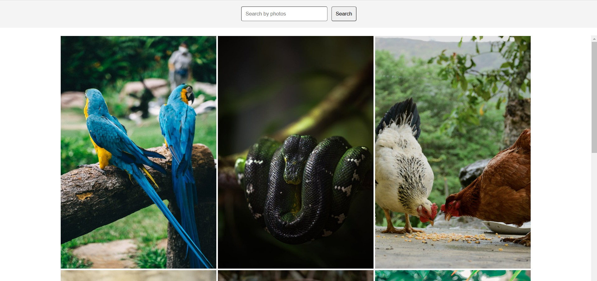
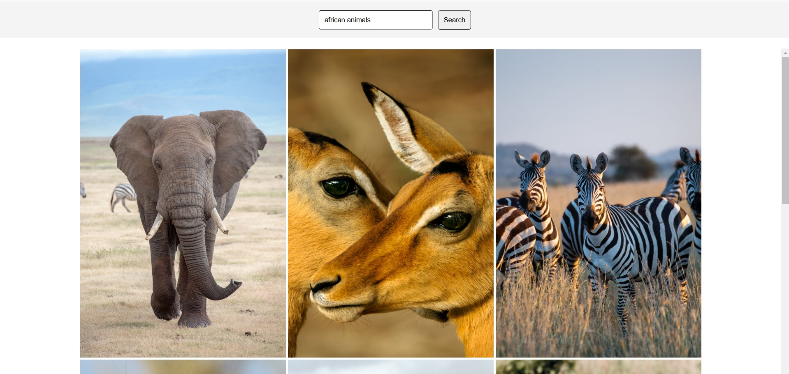
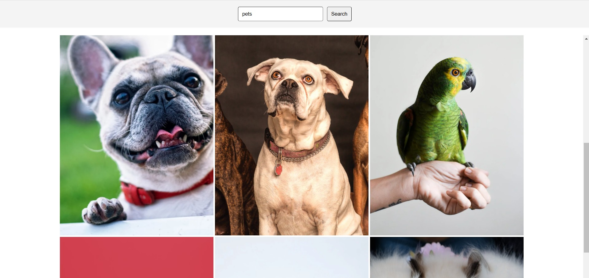

# Webpack Image Gallery

A simple image gallery built with Webpack.

## Table of Contents

- [Description](#description)
- [Technologies](#technologies)
- [Features](#features)
- [Installation](#installation)
- [Usage](#usage)
- [Screenshots](#screenshots)
- [Contact](#contact)

## Description

Webpack Image Gallery is an application that allows you to display a list of images and search for images using the Pexels API. It is built using Webpack, Node.js, HTML, CSS, JavaScript, and Axios.

## Technologies

- Webpack
- Node.js
- HTML
- CSS
- JavaScript
- Axios
- Pexels API

## Features

- Display a list of images
- Search for images

## Installation

To run this project, follow these steps:

1. Clone the repository:
    ```bash
    git clone https://github.com/jordanwmp/webpack-image-gallery.git
    ```

2. Navigate to the project directory:
    ```bash
    cd webpack-image-gallery
    ```

3. Install the dependencies:
    ```bash
    npm install
    ```

4. Create a `.env` file in the root directory and add your Pexels API key:
    ```env
    API_KEY=your_pexels_api_key
    ```

5. Start the development server:
    ```bash
    npm run server
    ```

## Usage

Once the server is running, open your browser and navigate to `http://localhost:8000` to view the image gallery. Use the search bar to find images based on your search query.

## Screenshots

Here are some screenshots of the application:

- 
- 
- 


